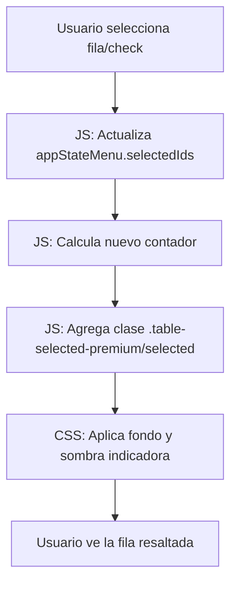

# Plan de Implementación: Corrección de Visualización de Selección en Carta de Precios

Se ha detectado que la funcionalidad de selección de platos en el módulo de Carta de Precios cuenta los elementos correctamente pero no los resalta visualmente. Esto se debe a que los estilos `table-selected-premium` no están presentes en el bloque `<style>` del archivo HTML fragmentado, y los estilos en el `.css` externo podrían no estar aplicándose o ser insuficientes para elementos `<tr>` con bordes separados.

## Cambios Propuestos

### Frontend y Estilos

1.  **[MODIFY] [resto_menu.html](file:///c:/Users/usuario/Documents/MultinegocioBaboons/app/static/resto_menu.html)**:
    *   Agregar las reglas CSS `.table-selected-premium` y `.menu-card-compact.selected` dentro del bloque `<style>` del archivo para asegurar que prevalezcan.
    *   Optimizar el estilo para que el fondo se aplique a las celdas (`td`) y se use un `box-shadow` como indicador lateral, garantizando visibilidad en todos los navegadores.

2.  **[MODIFY] [resto_menu.js](file:///c:/Users/usuario/Documents/MultinegocioBaboons/app/static/js/modules/resto_menu.js)**:
    *   Asegurar que la clase se aplique Consistentemete al contenedor correcto durante el evento de cambio del checkbox.

## Diagrama de Flujo del Cambio

## Verificación Plan

### Manual Verification
1.  Ingresar al módulo de "Gestión de Carta".
2.  Cambiar a "Vista Tabla".
3.  Hacer clic en una fila o marcar su checkbox.
4.  **Resultado esperado**: La fila debe teñirse de un azul suave y mostrar una barra lateral indigo a la izquierda. El contador de la barra superior debe aumentar.
5.  Repetir en "Vista Mosaico".
6.  **Resultado esperado**: La tarjeta debe mostrar un borde marcado y un fondo distintivo.
7.  Probar "Seleccionar Todo" y deseleccionar.
