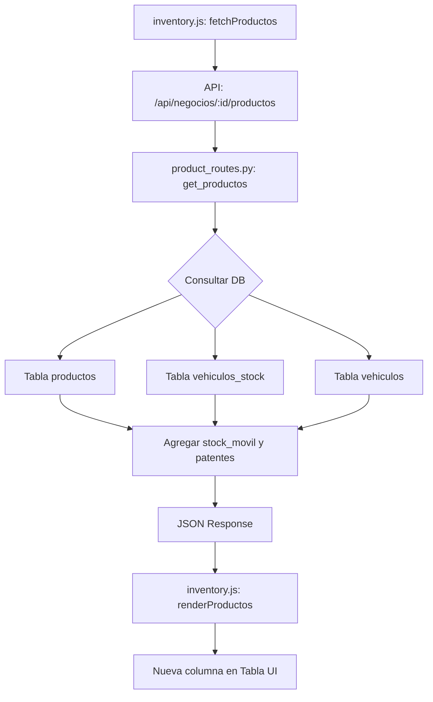

# Plan de Implementación - Mejora del Módulo de Inventario (Columna Stock Móvil)

Agregar una nueva columna a la tabla de inventario para mostrar el stock móvil (mercadería cargada en vehículos) y las patentes de los vehículos correspondientes.

## Diagrama de Flujo

## Cambios Propuestos

### Backend

#### [MODIFY] [product_routes.py](file:///c:/Users/usuario/Documents/MultinegocioBaboons/app/routes/product_routes.py)
- Modificar la función `get_productos` para integrar datos de stock móvil.
- **SQL Seguro**:
    - Obtener el `negocio_id` desde `g.negocio_id` (o el parámetro de ruta validado).
    - Realizar un `LEFT JOIN` (o subconsulta) con `vehiculos_stock` y `vehiculos`.
    - **Regla de Sintaxis**: NO usar `AS` para alias de tablas. Ejemplo: `FROM productos p`.
    - **Compatibilidad**: Utilizar procesamiento en Python para la agregación de patentes si la sintaxis `STRING_AGG` v `GROUP_CONCAT` genera conflictos entre SQLite y Postgres, asegurando así la estabilidad.
    - Campos nuevos en el JSON: `stock_movil` (entero) y `patentes_movil` (string).

### Frontend

#### [MODIFY] [inventory.js](file:///c:/Users/usuario/Documents/MultinegocioBaboons/app/static/js/modules/inventory.js)
- Actualizar la función `renderProductos`:
    - Agregar "Stock Móvil (Vehículo)" al encabezado de la tabla.
    - Insertar una nueva celda en cada fila que muestre la cantidad móvil y las patentes (ej: `10 (ABC-123, DEF-456)`).
    - Si no hay stock móvil, mostrar `0` o `-`.
- **Estilos**: Asegurar el uso de la clase `.tabla-bonita` definida en `global.css`.

## Reglas Críticas Aplicadas
- **Idioma**: Todo el documento y comentarios en español.
- **Base de Datos**: No se requiere migración estructural, solo lectura de tablas existentes.
- **Entorno**: El código funcionará tanto en SQLite (Desarrollo) como en Postgres (Producción).

## Plan de Verificación

### Verificación Manual
1. **Preparación**:
    - Tener al menos un vehículo registrado.
    - Cargar stock a un vehículo mediante el módulo de "Hoja de Ruta" -> "Control Carga" o la página de Inventario Móvil.
2. **Prueba**:
    - Abrir el módulo "Inventario".
    - Confirmar que aparece la columna "Stock Móvil (Vehículo)".
    - Verificar que los valores coinciden con la carga del vehículo.
    - Probar con productos que estén en más de un vehículo para validar la lista de patentes.
