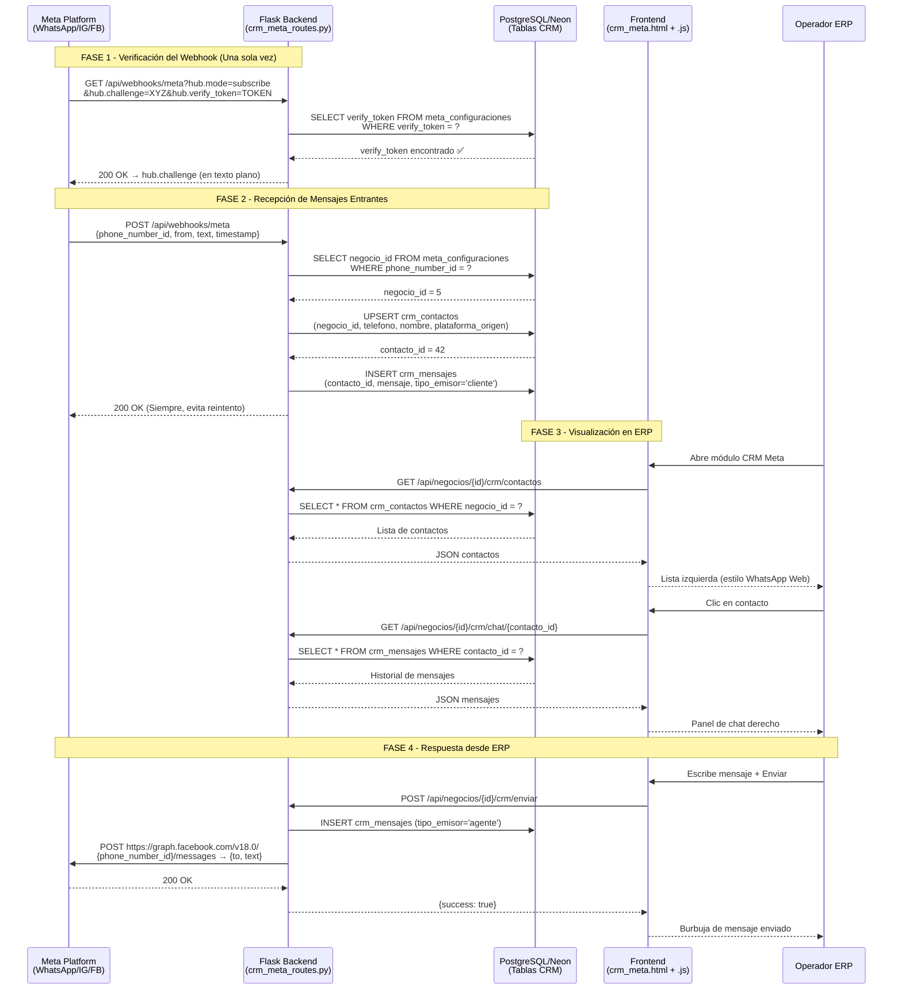

# 📋 Plan de Implementación: Módulo CRM Meta

> **Estado:** EN ESPERA DE APROBACIÓN  
> **Fecha:** 2026-04-10  
> **Conversación:** ec8ce9d0-c400-4b00-a802-143878f0ab7f  

---

## 📌 Resumen Ejecutivo

Integración de un nuevo módulo "CRM Meta" para centralizar mensajes de WhatsApp, Facebook e Instagram dentro del ERP Multinegocio Baboons. El módulo cubre la recepción de mensajes vía Webhook de Meta, su almacenamiento en base de datos, y una interfaz tipo "WhatsApp Web" para que los operadores respondan desde el ERP.

---

## 📁 Inventario de Archivos

| Operación | Archivo | Descripción |
|-----------|---------|-------------|
| `[NEW]` | `migrations/2026_04_10_1944_crm_meta_setup.sql` | Migración: 3 tablas nuevas + rollback completo |
| `[NEW]` | `app/routes/crm_meta_routes.py` | Blueprint Flask con todos los endpoints del módulo |
| `[MODIFY]` | `app/routes/admin_routes.py` | Registrar `crm_meta` en `erp_catalogue` + resetear `_modules_seeded` |
| `[MODIFY]` | `app/__init__.py` | Importar y registrar `crm_meta_routes.bp` en el array `blueprints` |
| `[MODIFY]` | `app/static/js/modules/erp_registry.js` | Agregar entrada `crm_meta` al objeto `ERP_REGISTRY` |
| `[NEW]` | `app/static/crm_meta.html` | UI principal del módulo (layout tipo WhatsApp Web) |
| `[NEW]` | `app/static/js/modules/crm_meta.js` | Lógica JS del módulo (lista contactos + chat) |

---

## 🔄 Diagrama de Flujo de Datos — Webhook Meta



---

## 📐 Especificaciones Técnicas por Fase

### FASE 1 — Migración SQL

**Archivo:** `migrations/2026_04_10_1944_crm_meta_setup.sql`

**Reglas aplicadas:**
- `CREATE TABLE IF NOT EXISTS` ✅
- `SERIAL PRIMARY KEY` ✅  
- `TIMESTAMP WITH TIME ZONE DEFAULT CURRENT_TIMESTAMP` ✅
- `NULLIF(TRIM(campo), '')` — aplicado en constraints y comentarios ✅
- `COMMENT ON COLUMN` para documentación ✅
- Rollback completo al final del archivo ✅

**Tablas a crear:**
1. `meta_configuraciones` — credenciales por negocio (phone_number_id, access_token, verify_token)
2. `crm_contactos` — leads/contactos unificados (negocio_id, nombre, teléfono, plataforma_origen)
3. `crm_mensajes` — historial de chat por contacto (contacto_id, mensaje, tipo_emisor, fecha)

---

### FASE 2 — Backend Python/Flask

**Archivo nuevo:** `app/routes/crm_meta_routes.py`

| Endpoint | Método | Auth | Descripción |
|----------|--------|------|-------------|
| `/api/webhooks/meta` | `GET` | **Público** (sin JWT) | Verificación hub.challenge de Meta |
| `/api/webhooks/meta` | `POST` | **Público** (firmada por Meta) | Recepción de mensajes entrantes |
| `/api/negocios/<id>/crm/contactos` | `GET` | JWT requerido | Lista de contactos del negocio |
| `/api/negocios/<id>/crm/chat/<contacto_id>` | `GET` | JWT requerido | Historial de mensajes de un contacto |
| `/api/negocios/<id>/crm/enviar` | `POST` | JWT requerido | Enviar mensaje desde el ERP vía API Meta |
| `/api/negocios/<id>/crm/meta-config` | `GET/POST` | JWT requerido | Gestionar credenciales Meta del negocio |

**Lógica del webhook POST:**
1. Parsear el payload de Meta para extraer `phone_number_id` y datos del remitente
2. Buscar `negocio_id` en `meta_configuraciones` filtrando por `phone_number_id`
3. Hacer UPSERT en `crm_contactos` (evitar duplicados por teléfono+negocio)
4. Insertar en `crm_mensajes` con `tipo_emisor = 'cliente'`
5. Retornar `200 OK` **siempre** (para evitar reintentos de Meta)

---

### FASE 3 — Registro del Módulo (OBLIGATORIO)

#### Paso 3a — `admin_routes.py`
- Agregar al `erp_catalogue` bajo categoría `'Ventas'`:
  ```python
  ('crm_meta', 'CRM Meta (WhatsApp/IG/FB)', 'Ventas', ['resto', 'distribuidora', 'retail']),
  ```
- Cambiar `_modules_seeded = False` en línea 13 para forzar re-seed

#### Paso 3b — `erp_registry.js`
- Agregar entrada bajo la sección CRM:
  ```javascript
  'crm_meta': {
      label: 'CRM Meta (WhatsApp/IG/FB)',
      icon: 'static/img/icons/clientes.png',
      path: 'static/crm_meta.html',
      category: 'operaciones',
      color: 'rgba(37, 211, 102, 0.12)'  // Verde WhatsApp
  },
  ```

#### Paso 3c — `__init__.py`
- Agregar import: `from .routes import crm_meta_routes`
- Agregar al array `blueprints`: `(crm_meta_routes.bp, '/api')`

---

### FASE 4 — Frontend

#### `crm_meta.html`
- Layout tipo WhatsApp Web: panel izquierdo (contactos) | panel derecho (chat)
- Header con filtro por plataforma (WhatsApp / Instagram / Facebook)
- Respeta el design system "Premium Clear" (Light Mode, sin glassmorphism)
- Usa clases `.tabla-bonita` para la lista de contactos
- Modal `baboons-modal` para configurar credenciales Meta

#### `crm_meta.js`
- Usa `appState.negocioActivoId` para todas las peticiones
- Polling cada 10s para nuevos mensajes (o manual con botón refresh)
- Diferenciación visual de burbujas: cliente (gris, izquierda) / agente (verde, derecha)
- Estado de conexión: badge indicando si el webhook está configurado

---

## ⚠️ Puntos de Atención (Riesgos)

> [!IMPORTANT]
> El endpoint `GET /api/webhooks/meta` es **público** (no lleva `@token_required`). Esto es por diseño y requerimiento de Meta. El endpoint `POST` también es público pero valida la firma HMAC de Meta para seguridad.

> [!WARNING]
> El código `crm_meta` NO debe colisionar con `crm_contactos` ni `crm_social` ya existentes en el sistema. Son módulos independientes. El nuevo módulo es específico para la integración con la API de Meta Business.

> [!NOTE]
> El `access_token` de Meta se almacena en la tabla `meta_configuraciones`. En producción se recomienda cifrar este campo. En esta primera versión se almacena en texto plano protegido únicamente por el acceso a la DB (Neon).

> [!CAUTION]
> Tras agregar `crm_meta` al `erp_catalogue`, se debe resetear `_modules_seeded = False` en `admin_routes.py`. Sin este paso, el módulo no aparecerá en el dashboard aunque esté registrado, ya que el seeder solo corre cuando detecta diferencia en el COUNT.

---

## ✅ Checklist de Validación Post-Implementación

- [ ] Ejecutar migración SQL en producción (Neon) y verificar las 3 tablas creadas
- [ ] Verificar que `GET /api/webhooks/meta?hub.mode=subscribe&hub.challenge=test&hub.verify_token=TOKEN` retorna `test` como texto plano
- [ ] Configurar el Webhook en el panel de Meta Business Suite apuntando a `https://[dominio]/api/webhooks/meta`
- [ ] Enviar un mensaje de prueba a WhatsApp y verificar que aparece en `crm_mensajes`
- [ ] Acceder al módulo `CRM Meta` desde el ERP y verificar el layout dos paneles
- [ ] Enviar un mensaje desde el ERP y verificar entrega en WhatsApp
- [ ] Verificar que ningún blueprint previo fue eliminado (`git diff app/__init__.py`)
