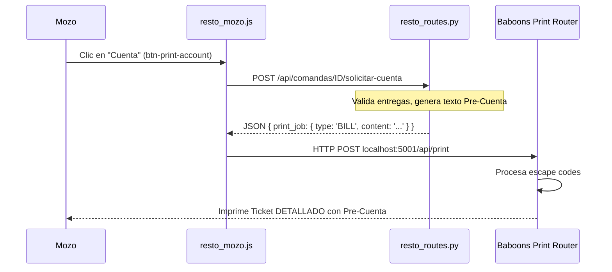

# Plan de Implementación: Corrección de Pre-Cuenta y Migración Restó POS

Este plan aborda la falta de sincronización en los cambios de impresión reportados por el usuario y regulariza la arquitectura de la base de datos siguiendo las [Reglas Globales](file:///c:/Users/usuario/Documents/MultinegocioBaboons/.agents/rules.md).

## Problema Identificado
1. **Desacoplamiento de Versión**: El usuario reporta que no ve los cambios ("V.1.0" no aparece) y los logs muestran que el navegador sigue en la versión `1.6.5` a pesar del deploy de la `1.6.6`.
2. **Violación de Arquitectura DB**: Se incluyó una migración `ALTER TABLE` directamente en una ruta de Python, lo cual infringe la Regla 16.
3. **Falla de Formato**: El ticket impreso sigue saliendo como "Comanda de Cocina" en lugar de "Pre-Cuenta".

## Propuesta de Cambios

### 1. Base de Datos (Regla 16 y 19)
Separar la lógica de migración del código aplicativo. Ya se ha creado el archivo SQL, falta limpiar el backend.
- [MODIFY] `app/routes/resto_routes.py`: Eliminar el bloque `try/except` con `ALTER TABLE`.

### 2. Agente Local de Impresión (CRÍTICO)
Se detectó que `baboons_print_router.py` tiene el título "COMANDA DE COCINA" fijo en el código.
- [MODIFY] `baboons_print_router.py`: 
    - Modificar `format_receipt` para que reconozca el campo `type`.
    - Si `type == 'BILL'`, imprimir directamente el campo `content` (formato libre) enviado por el servidor.
    - Esto permitirá que los precios y la leyenda de Pre-Cuenta aparezcan finalmente.

### 3. Backend (Rutas de Impresión)
- [MODIFY] `app/routes/resto_routes.py`: 
    - Asegurar que `solicitar_cuenta_comanda` siempre devuelva el objeto `print_job` con `type: 'BILL'`.
    - Revisar si el agente local requiere un campo específico para forzar el título "PRE-CUENTA".

### 4. Frontend (Caché y Sincronización)
- [MODIFY] `app/static/js/main.js` y `service-worker.js`: Verificar que el incremento a `1.6.6` sea efectivo para forzar la limpieza de caché.

### 5. Documentación (Regla 5)
- [NEW] `docs/informes/plan_fix_resto_printing.md`: Copia de este plan.
- [NEW] `docs/pruebas/resultado_fix_resto_printing.md`: Walkthrough final.

## Diagrama de Flujo del Proceso

## Verificación Planificada

### Verificación Manual
1. Abrir consola del navegador y verificar `window.APP_VERSION === "1.6.6"`.
2. Ejecutar `fly deploy` y confirmar el reinicio de las máquinas.
3. Solicitar cuenta de una mesa con ítems variados.
4. Validar que el ticket diga "PRE-CUENTA" y tenga el desglose de precios unitarios.
5. Confirmar presencia de "V.1.0" en el pie del ticket.
