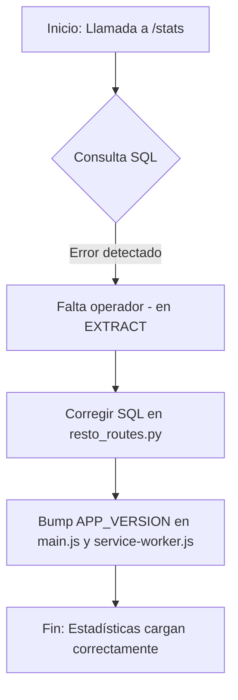

# Plan de Implementación - Corrección de Estadísticas Restó y Bump de Versión

Se detectó un error de sintaxis SQL en el cálculo del tiempo promedio de preparación en el dashboard de estadísticas de Restó. Además, se procederá a incrementar la versión de la aplicación para asegurar que los cambios en el frontend se refresquen correctamente.

## Archivos a Modificar
1. [MODIFY] `app/routes/resto_routes.py`: Corregir la resta de timestamps en la consulta SQL.
2. [MODIFY] `app/static/js/main.js`: Incrementar `APP_VERSION` a `1.9.15`.
3. [MODIFY] `service-worker.js`: Incrementar `APP_VERSION` a `1.9.15` y actualizar el historial de cambios.

## Diagrama de Flujo

## Tareas Detalladas
1. **app/routes/resto_routes.py**:
   - Cambiar `fecha_estado_cambiado  fecha_pedido` por `fecha_estado_cambiado - fecha_pedido`.
2. **app/static/js/main.js**:
   - Actualizar `export const APP_VERSION = "1.9.14";` a `"1.9.15"`.
3. **service-worker.js**:
   - Actualizar `const APP_VERSION = "1.9.14";` a `"1.9.15"`.
   - Agregar nota en el historial: `// 1.9.15: Corregido error de sintaxis en estadísticas de Restó.`

## Verificación
- Cargar el Dashboard de Estadísticas de Restó y verificar que los gráficos y el "Tiempo Promedio" se muestren sin errores 500.
- Verificar en consola que la versión cargada sea la `1.9.15`.
