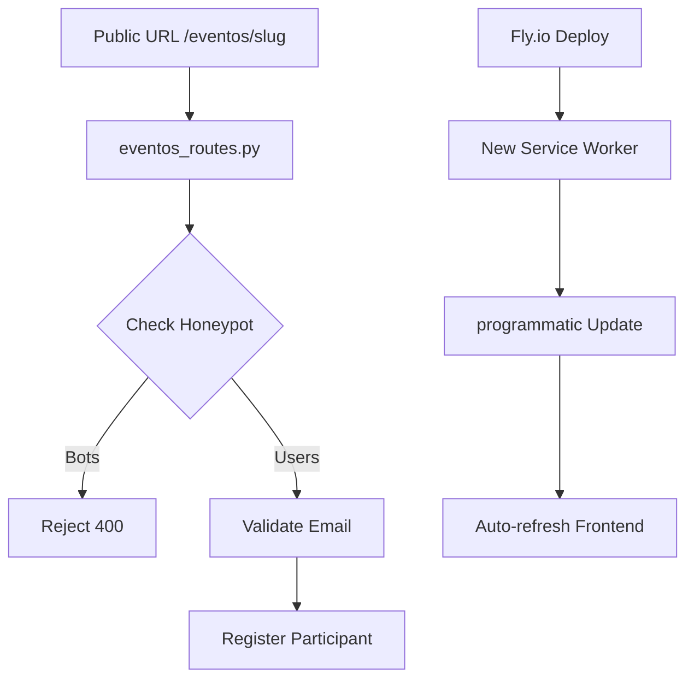

# Plan de Seguridad y Estabilidad de Sistema (Fly.io Ready)

Este documento detalla las medidas de seguridad para la autenticación y la registración de eventos, además de la automatización de la caché para despliegues en Fly.io.

## User Review Required

> [!IMPORTANT]
> - **Auto-Actualización**: Se implementa lógica de `skipWaiting` y recarga automática en el frontend al detectar una nueva versión tras un `fly deploy`.
> - **Registro de Módulos**: Se configuró el auto-seed para los módulos `eventos` y `resto_stats`.

## Proposed Changes

### [Backend]

#### [MODIFY] admin_routes.py
- Se añade auto-seeding para los módulos `eventos` y `resto_stats`.

#### [MODIFY] eventos_routes.py
- Implementación de slugs virtuales y honeypot anti-bots.

### [Frontend]

#### [MODIFY] service-worker.js
- Upgrade a versión 1.6.0.
- Lógica de `self.skipWaiting()` en evento de instalación.

#### [MODIFY] main.js
- Exposición global de `fetchData` y `sendData`.
- Listener de actualización de Service Worker con notificación y recarga.
