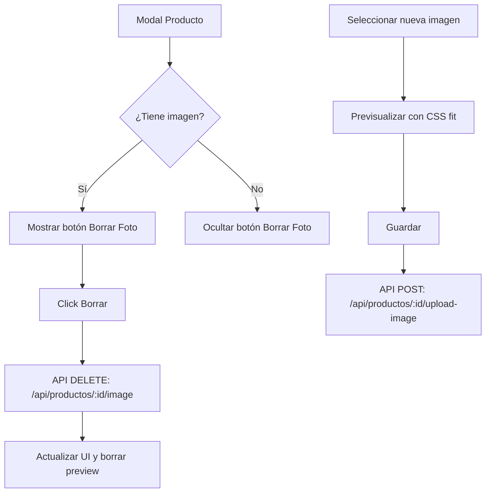

# Plan de Implementación - Mejora Gestión de Imágenes en Productos

Optimizar el modal de edición de productos para permitir la eliminación de imágenes existentes y asegurar que las nuevas imágenes no desborden el diseño.

## Diagrama de Flujo

## Cambios Propuestos

### Backend

#### [NEW] [product_routes.py](file:///c:/Users/usuario/Documents/MultinegocioBaboons/app/routes/product_routes.py)
- Agregar endpoint `@bp.route('/productos/<int:producto_id>/image', methods=['DELETE'])`.
- Lógica:
    1. Buscar producto.
    2. Si tiene `imagen_url`, eliminar archivo físico usando `os.remove`.
    3. Actualizar DB: `SET imagen_url = NULL`.

### Frontend

#### [MODIFY] [inventario.html](file:///c:/Users/usuario/Documents/MultinegocioBaboons/app/static/inventario.html)
- Agregar un botón `<button type="button" id="btn-eliminar-foto" class="btn-danger btn-sm" style="display:none;">Eliminar Foto</button>` junto a la previsualización.

#### [MODIFY] [inventory.css](file:///c:/Users/usuario/Documents/MultinegocioBaboons/app/static/css/inventario.css)
- Definir clase `.img-preview` con `max-height: 200px` y `overflow: hidden`.
- Asegurar que la imagen dentro tenga `object-fit: contain` para no distorsionarse ni crecer indefinidamente.

#### [MODIFY] [inventory.js](file:///c:/Users/usuario/Documents/MultinegocioBaboons/app/static/js/modules/inventory.js)
- **abrirModal**: Mostrar/ocultar el botón "Eliminar Foto" según el producto tenga imagen o no.
- **Evento Click Borrar**: Llamar al nuevo endpoint de DELETE y limpiar el preview.
- **Validación Visual**: Asegurar que al seleccionar un archivo nuevo, el preview se mantenga dentro de los límites.

## Reglas Críticas Aplicadas
- **Idioma**: Español.
- **Aesthetics**: Mejora del UX al no romper el layout con imágenes grandes.

## Plan de Verificación

### Verificación Manual
1. Abrir producto con foto existente:
    - Verificar que aparece el botón "Eliminar Foto".
    - Click en "Eliminar": la foto debe desaparecer del modal y del servidor.
2. Añadir producto con foto muy alta/grande:
    - Verificar que el preview se mantiene dentro de un tamaño razonable y no empuja los botones de guardado fuera de vista.
3. Guardar y verificar que la imagen se sube correctamente.
