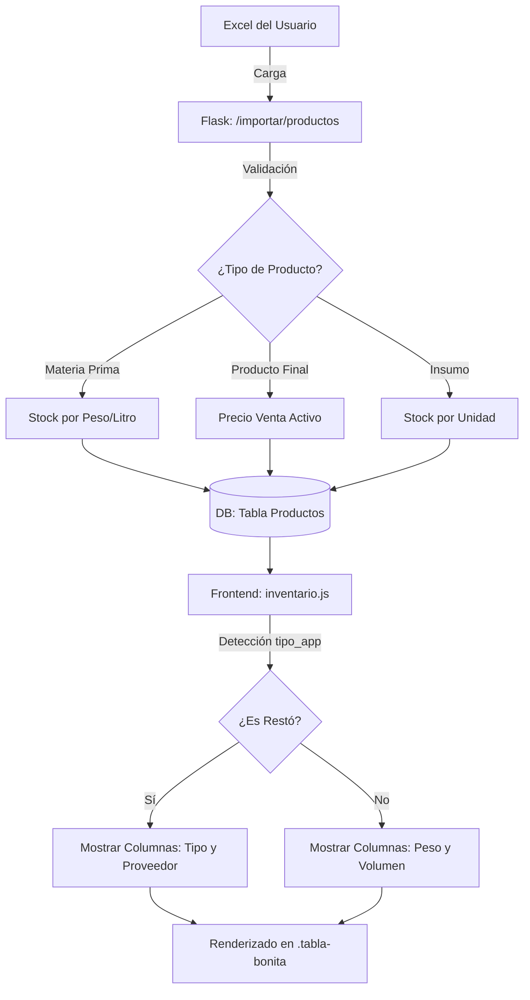

# Plan de Implementación: Inventario Especializado para Restó (v2)

Siguiendo las reglas estrictas del proyecto (**vía `.agents/rules.md`**), se propone la especialización del módulo de inventario para diferenciar la operativa de un Restó de una Distribuidora.

## Análisis de Requerimientos
1.  **Maestro Dinámico**: La vista de inventario debe adaptarse al `tipo_app` del negocio activo.
2.  **Categorización Restó**: Soporte para Materia Prima (MP), Producto Final (PF) e Insumos.
3.  **Importación Masiva**: Plantilla Excel para carga inicial de estos productos.

---

## Diseño del Flujo (Mermaid)

### [NEW] Plantilla de Importación de Productos (Mapeo de Excel)
Basado en la imagen, el sistema procesará las siguientes columnas:
1.  **Categoría**: Se creará automáticamente en `productos_categoria` si no existe.
2.  **Producto**: Mapa al campo `nombre`.
3.  **Alias**: Mapa al campo `alias`.
4.  **SKU**: Mapa al campo `sku`.
5.  **Stock**: Carga de stock inicial.
6.  **Unidad**: Mapa al campo `unidad_medida` (un, kg, lt).
7.  **Precio Base**: Mapa a `precio_venta` (o `precio_costo` según se defina).
8.  **Tipo (MANUAL)**: Debes añadir esta columna al Excel. Las opciones válidas para que el sistema las reconozca son:
    - **`materia_prima`**: Para ingredientes de cocina/barra.
    - **`producto_final`**: Para platos, bebidas y artículos de venta directa.
    - **`insumo`**: Para descartables, artículos de limpieza, etc.

---

## Cambios Propuestos

### 1. Base de Datos (Migración SQL Idempotente)
- No se requieren cambios estructurales si `tipo_producto` existe, pero se generará un script de limpieza de tipos para normalizar los existentes a `producto_final`.

### 2. Backend (Actualización de import_routes.py)
- Implementar `/negocios/<id>/importar/productos` con restricción estricta: `if current_user['rol'] != 'superadmin': abort(403)`.
- Lógica de mapeo:
    - `Precio Base` -> `precio_venta`.
    - `Tipo` -> `tipo_producto` (normalizando a minúsculas y guiones bajos).

### 3. Frontend (inventario.js)
- Adaptar la vista para ocultar campos de logística industrial (Peso/Volumen) en negocios de tipo **Restó**.
- Integrar el botón de importación en la barra de herramientas del inventario.

---

## Verificación Planificada

### Pasos de Validación
1.  **Seguridad**: Intentar importar con un usuario con rol "admin" o "vendedor" y verificar que el sistema lo rechace.
2.  **Carga Completa**: Subir el archivo de la imagen con la columna "Tipo" añadida. Comprobar que los "Aperitivos" queden como `producto_final`.

---

## Sincronización de Documentación
- `implementation_plan.md` -> `docs/informes/plan_importacion_resto.md`
- `walkthrough.md` -> `docs/pruebas/resultado_importacion_resto.md`
