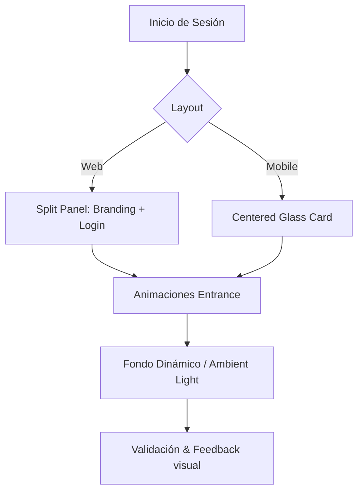

# Plan de Implementación - Login Baboons Premium

Este plan detalla la transformación de la página de inicio de sesión actual hacia una estética **Baboons Premium**, enfocada en la sofisticación visual, interactividad y una primera impresión de alto impacto.

## 1. Análisis de Situación Actual
- **Layout**: Centrado simple sobre fondo oscuro.
- **Estética**: Funcional pero básica; carece de profundidad y carácter "Premium".
- **Interactividad**: Limitada a la entrada de datos y ocultar/mostrar contraseña.
- **Respuesta**: El modo móvil desactiva elementos visuales para priorizar carga, pero pierde identidad de marca.

## 2. Propuesta "Baboons Premium"
Inspirado en tendencias de diseño de 2024 (Glassmorphism avanzado, Bento layouts, Micro-animaciones), la nueva versión propone:

### A. Rediseño del Layout
- **Versión Desktop**: Layout dividido (Split View) de alto impacto.
  - **Panel Izquierdo (Branding)**: Presenta una composición visual que integra icons/3D de **Distribución, Restó y Retail** bajo la identidad unificada de Baboons. Incluye el logo oficial y una narrativa de "Gestión Inteligente".
  - **Panel Derecho (Acceso)**: Formulario de login con efecto ultra-glass, tipografía técnica y feedback visual refinado.
- **Versión Mobile**: Enfoque vertical con cabecera de marca y tarjeta expandida.

### B. Mejoras Visuales y UX
- **Branding**: Uso del logo silhouette oficial.
- **Interactividad**:
  - Animaciones coordinadas que representan la integración de los tres negocios.
  - Campos de entrada con validación en tiempo real y transiciones de color.
- **Estética**: Combinación de Slate Dark con acentos vibrantes (Primary Gradient).

## 3. Mockup de Referencia (Multinegocio)

## 4. Archivos a Modificar
- `[MODIFY] app/static/login_secure.html`: Reestructuración del layout para soportar el split panel.
- `[MODIFY] app/static/css/login.css`: Rediseño total de estilos, animaciones y efectos de cristal.

## 5. Diagrama de Flujo Visual

## 6. Verificación Manual
1. Validar visualmente el efecto glassmorphism en distintos navegadores.
2. Comprobar la transición fluida de desktop a mobile (responsividad).
3. Verificar que las animaciones no afecten el tiempo de interacción percibido.
