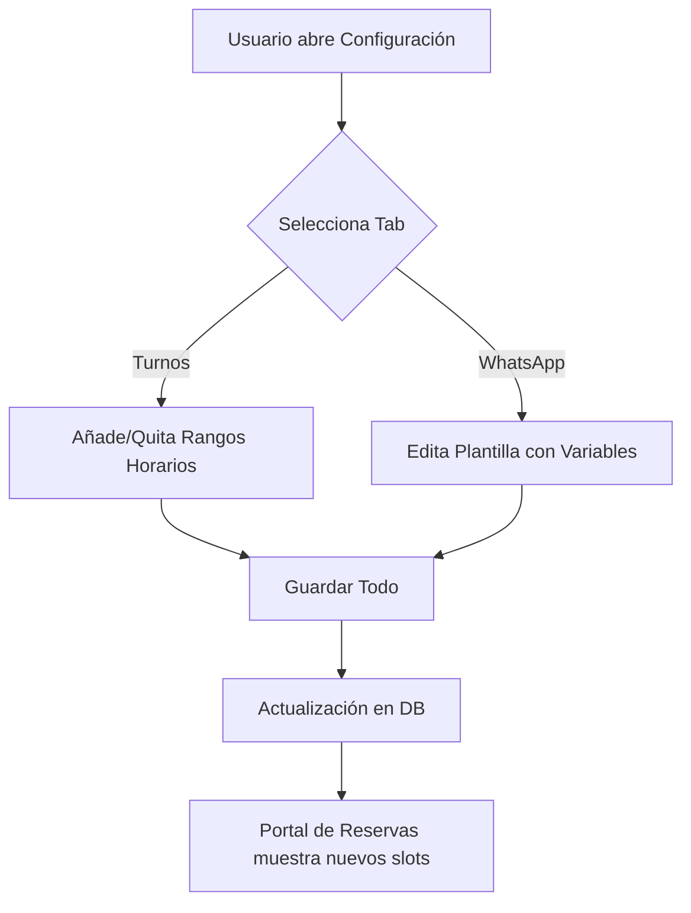

# Plan de Implementación: Mejora del Módulo de Reservas (Restó)

Este plan detalla las modificaciones necesarias para modernizar el sistema de reservas, permitiendo múltiples turnos por día, campos adicionales del cliente (Cumpleaños, Sector Preferido) y un sistema de plantillas para WhatsApp.

## Cambios Propuestos

### 1. Base de Datos (Back-end)

#### [MODIFY] [reservas_routes.py](file:///c:/Users/usuario/Documents/MultinegocioBaboons/app/routes/reservas_routes.py)
- **Migración**: Añadir columnas `fecha_nacimiento` (DATE) y `sector_preferido` (VARCHAR) a la tabla `mesas_reservas`.
- **Configuración**: Crear tabla `resto_reservas_config` para plantillas de WhatsApp.
- **Turnos**: Modificar `resto_turnos_config` para permitir múltiples entradas dinámicas por día eliminando la restricción de un solo rango.
- **Lógica de Disponibilidad**: Actualizar `portal_disponibilidad` para iterar sobre todos los rangos horarios activos del día.

### 2. Interfaz de Usuario (Front-end)

#### [MODIFY] [reservas.html](file:///c:/Users/usuario/Documents/MultinegocioBaboons/app/static/reservas.html)
- **Formulario de Reserva**: Añadir inputs para Fecha de Nacimiento y Selector de Sector (VIP, Terraza, etc.).
- **Modal de Configuración**: Implementar sistema de pestañas (Turnos vs. WhatsApp).
- **Turnos**: Permitir añadir/quitar filas de rangos horarios dinámicamente.

#### [MODIFY] [reservas.js](file:///c:/Users/usuario/Documents/MultinegocioBaboons/app/static/js/modules/reservas.js)
- **Persistencia**: Actualizar `guardarReservaManual` para enviar los nuevos campos.
- **Visualización**: Actualizar `verDetalleReserva` para mostrar los datos extendidos.
- **WhatsApp**: Implementar lógica de reemplazo de etiquetas (`{nombre}`, `{fecha}`, etc.) en el enlace de WhatsApp.

## Diagrama de Flujo

## Plan de Verificación

### Pruebas Automatizadas
- No se requieren pruebas unitarias nuevas, se validará mediante flujo de UI.

### Verificación Manual
1. **Configuración**: Crear dos turnos para el Lunes (Mañana y Noche).
2. **Reserva**: Realizar una reserva manual completando el Cumpleaños y eligiendo "Terraza".
3. **Confirmación**: Abrir el detalle de la reserva y hacer clic en "Enviar WhatsApp", verificar que el mensaje use la plantilla personalizada.
