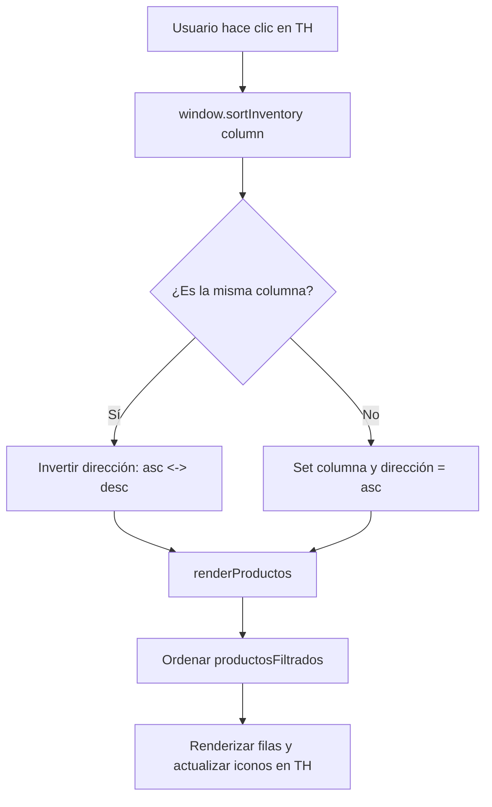

# Plan de Implementación - Ordenamiento de Columnas en Inventario

Permitir al usuario ordenar la tabla de productos haciendo clic en los encabezados de las columnas móviles.

## Diagrama de Flujo

## Cambios Propuestos

### Frontend

#### [MODIFY] [inventory.js](file:///c:/Users/usuario/Documents/MultinegocioBaboons/app/static/js/modules/inventory.js)
- **Estado**: Agregar variables `sortColumn` (default: 'nombre') y `sortDirection` (default: 'asc').
- **Lógica de Ordenamiento**:
    - Crear función `sortData(data, column, direction)` que maneje strings y números adecuadamente.
    - Integrar esta función en `renderProductos` antes de la paginación.
- **UI de Encabezados**:
    - Actualizar la generación del `headerRow.innerHTML` para que los encabezados tengan `onclick="window.sortInventory('campo')"`.
    - Agregar iconos de FontAwesome (`fa-sort`, `fa-sort-up`, `fa-sort-down`) para indicar el estado del orden.
    - Agregar estilos inline (o sugerir en `global.css` si es recurrente) para `cursor: pointer`.
- **Exposición Global**: Exponer `window.sortInventory` para que sea accesible desde el HTML generado dinámicamente.

## Reglas Críticas Aplicadas
- **Idioma**: Español.
- **Arquitectura**: No requiere cambios en el backend ni en la base de datos.
- **Frontend**: Se mantiene la consistencia con `global.css` y las prácticas del proyecto.

## Plan de Verificación

### Verificación Manual
1. Abrir **Inventario**.
2. Hacer clic en el encabezado **Nombre**:
    - Verificar que se ordena de A-Z.
    - Hacer clic de nuevo: verificar que se ordena de Z-A.
3. Repetir con **Stock**, **Categoría** y **Precio**.
4. Verificar que el ordenamiento persiste al cambiar de página o aplicar filtros de búsqueda.
