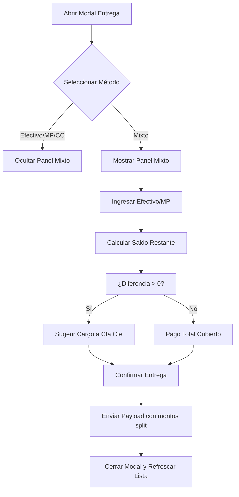

# Plan de Implementación: Corrección de Pago Mixto en Modo Repartidor

Este plan detalla la corrección del flujo de pago "Mixto / Parcial" en el modal de confirmación de entrega del Módulo de Logística (Modo Repartidor). Actualmente, al seleccionar esta opción, no se muestra el panel de desglose ni se procesan los montos correctamente. Replicaremos la lógica probada en el módulo de Pedidos para mantener la consistencia.

## Revisión del Usuario Requerida

> [!IMPORTANT]
> - El sistema permitirá una diferencia entre el monto ingresado (Efectivo + MP) y el total del pedido.
> - **Cualquier saldo restante se cargará automáticamente a la Cuenta Corriente (Cta Cte)** del cliente.
> - Se mostrará en tiempo real el monto que "queda pendiente" para Cta Cte mientras el usuario edita los pagos parciales.

## Diagrama de Flujo (Mermaid)

## Cambios Propuestos

### Módulo de Logística (Frontend)

---

#### [MODIFY] [logistica.js](file:///c:/Users/usuario/Documents/MultinegocioBaboons/app/static/js/modules/logistica.js)

- **`abrirModalEntrega`**: 
    - Resetear los inputs del panel mixto (`#monto-efectivo-mixto`, `#monto-mp-mixto`).
    - Vincular listeners de cambio (`change`) a los botones de opción (radio) para alternar la visibilidad de `#panel-pago-mixto`.
    - Vincular listeners de entrada (`input`) para disparar el cálculo del saldo restante en tiempo real.
- **`recalcularMixtoEntrega`**: Nueva función interna para calcular la diferencia entre el total del pedido y lo ingresado en efectivo/MP, mostrando el resultado como saldo sugerido a Cta Cte.
- **`confirmarEntregaBackend`**: 
    - Si el método es "Mixto", extraer los montos de los inputs.
    - El saldo restante se enviará como `monto_cta_cte`.
    - Enviar `monto_efectivo`, `monto_mp` y `monto_cta_cte` al endpoint `/api/pedidos/{id}/entregar`.

## Preguntas Abiertas

- *Plan aprobado con carga automática a Cta Cte para la diferencia.*

## Plan de Verificación

### Pruebas Automatizadas (Browser)
- Navegar a **Logística** -> **Hoja de Ruta** -> **Modo Repartidor**.
- Seleccionar un pedido pendiente y elegir "Mixto / Parcial".
- Verificar que el panel de desglose se vuelve visible.
- Ingresar montos (menores al total) y confirmar que el saldo a Cta Cte se muestra correctamente.
- Confirmar la entrega y verificar que la notificación de éxito aparezca.

### Verificación Manual
- El usuario podrá verificar en el historial del cliente o en la liquidación de la HR que el pago se dividió correctamente entre los medios seleccionados y el resto fue a Cuenta Corriente.
