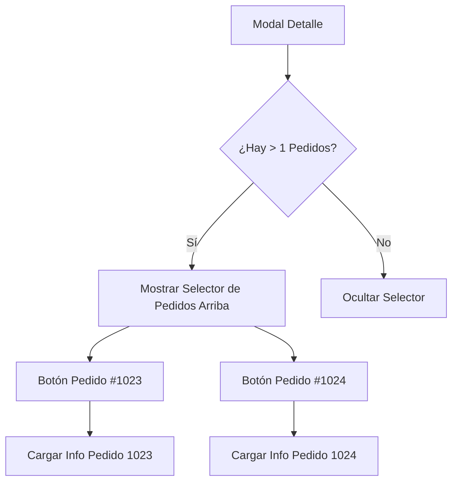

# Plan de Implementación: Selección Integrada de Pedidos Múltiples

Este plan soluciona el problema del modal "roto" de SweetAlert al integrar la selección de pedidos directamente en la vista de detalle premium de Baboons.

## User Review Required

> [!TIP]
> Se propone un diseño de **Botones de Cambio Rápido** en la parte superior del modal cuando el cliente tenga más de un pedido. Esto permite al usuario alternar entre ellos sin cerrar la vista.

## Cambios Realizados

### Frontend: UI y Lógica

#### [MODIFY] [hoja_ruta.html](file:///c:/Users/usuario/Documents/MultinegocioBaboons/app/static/hoja_ruta.html)
- Se añadió el contenedor `#ver-pedido-selector-container` al inicio de la `modal-body`.
- Estilo: Tarjeta ligera con bordes redondeados y sombra suave, conteniendo una lista de botones para cada pedido.

#### [MODIFY] [hoja_ruta.js](file:///c:/Users/usuario/Documents/MultinegocioBaboons/app/static/js/modules/hoja_ruta.js)
- **Eliminación de Swal.fire**: Se quitó la lógica de selección externa.
- **Refactorización de verPedidoCliente**:
    - Al abrir el modal, se detecta si hay más de un pedido.
    - Se renderiza dinámicamente un selector en la parte superior.
    - Se implementó `cargarDetallePedidoIndividual(id)` para refrescar el contenido del modal (productos, totales, obs) al hacer clic en un pedido diferente.

## Diagrama de la Interfaz

## Plan de Verificación

### Verificación Manual
1. Seleccionar un cliente con pedidos múltiples.
2. Hacer clic en el icono de pedido.
3. Validar que el modal se abra mostrando el primer pedido directamente.
4. Cambiar entre pedidos usando los botones superiores y verificar que los datos se actualicen correctamente.
