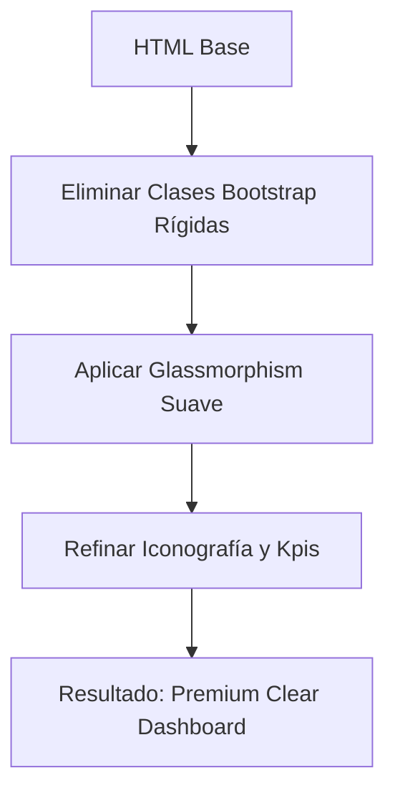

# Plan de Implementación - Rediseño Premium Clear Dashboard Restó

Se aplicará un estilo "Premium Clear" al módulo de estadísticas de Restó, priorizando la legibilidad, el uso de sombras suaves, tipografía moderna y una paleta de colores coherente con el sistema pero más refinada.

## Archivos a Modificar
1. [MODIFY] `app/static/resto_stats.html`: Reestructurar clases y estilos internos para lograr el acabado premium.

## Estrategia de Diseño
- **Contenedor Principal**: Fondo muy sutil (`#fdfdfd`) con espaciado amplio.
- **KPI Cards**: Cambiar de fondos sólidos a tarjetas blancas con indicadores de color laterales o iconos con fondos circulares suaves.
- **Tipografía**: Títulos con `letter-spacing` negativo y `font-weight` 800 para valores numéricos.
- **Gráficos/Tablas**: Eliminar bordes pesados, usar `border-radius: 20px` y sombras de alta difusión.
- **Interactividad**: Efectos de `hover` con elevación y cambio de saturación.

## Diagrama de Flujo Visual

## Verificación
- Abrir el dashboard de estadísticas.
- Verificar que las tarjetas tengan bordes redondeados amplios (20px+).
- Comprobar que el texto sea nítido y las sombras no se sientan "sucias".
- Validar la responsividad.
