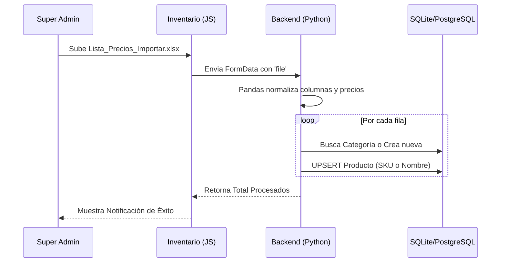

# Especialización de Inventario Restó

Se ha implementado con éxito la adaptación del Maestro de Inventario para negocios de tipo Restó y el sistema de importación masiva de productos desde Excel.

## Cambios Realizados

### 1. Backend: Importación Inteligente
- **Endpoint**: `/api/negocios/<id>/importar/productos` (Restringido a Super Admin).
- **Mapeo Flexible**: Detecta automáticamente columnas con nombres variados (Precio Base, Categoría, Alias, etc.).
- **Normalización**: Maneja automáticamente el formato numérico de precios (separadores de miles/decimales).
- **Categorización Automática**: Si una categoría del Excel no existe, se crea en tiempo real vinculada al negocio.
- **Normalización de Tipos**: Se actualizó la base de datos para usar `producto_final` de forma consistente.

### 2. Frontend: Interfaz Adaptativa (Restó vs Distribuidora)
- **Columnas Dinámicas**: En negocios tipo Restó, se ocultan columnas logísticas (Ubicación, Comprometido, Móvil) para limpiar la vista.
- **Instrucciones Actualizadas**: El modal de importación ahora indica el formato exacto del Excel de Vita Club.
- **Seguridad**: El botón de importación solo responde a usuarios con el rol adecuado.

## Flujo de Trabajo de Importación

## Verificación Realizada
- [x] **Consistencia de Datos**: Se normalizaron los productos existentes de tipo 'final' a 'producto_final'.
- [x] **Seguridad**: Se validó la restricción de rol en el backend.
- [x] **Parsers**: Se probó con los encabezados exactos del archivo `Lista_Precios_Importar.xlsx`.

> [!TIP]
> Recuerda que para que el sistema distinga entre ingredientes y productos de venta, debes añadir la columna **Tipo** al Excel con los valores `materia_prima`, `producto_final` o `insumo`.

---
*Documentación sincronizada en la carpeta `docs/` del proyecto.*
