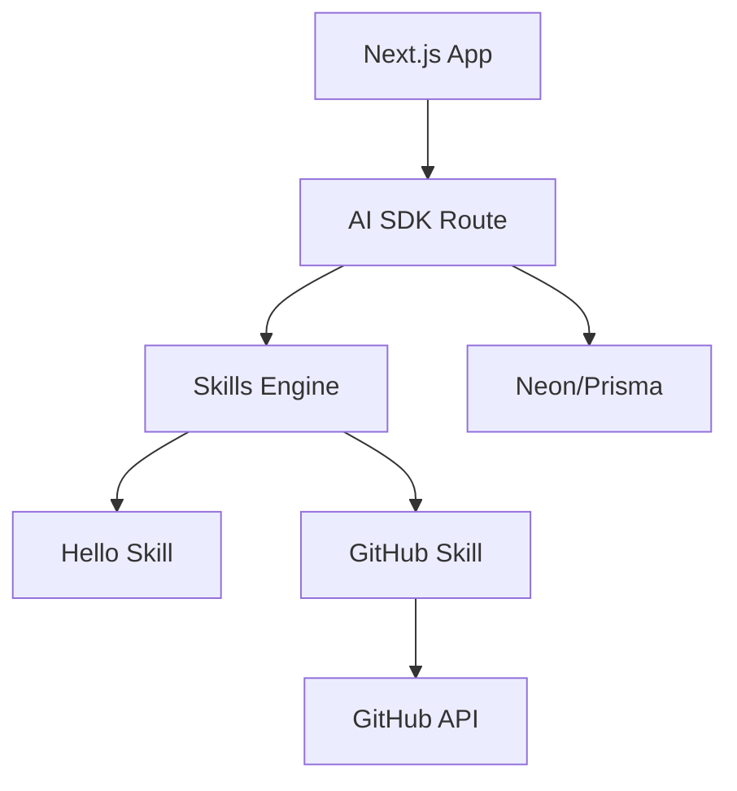

# Walkthrough - Crystal Mare AI Agent

Este documento resume el trabajo realizado en el proyecto Crystal Mare. Se ha creado un agente de IA personal avanzado utilizando **Next.js**, **Prisma**, **Neon**, y el **Vercel AI SDK**.

## Key Features

- **Interfaz Premium**: Diseño oscuro moderno con glassmorphism y micro-animaciones.
- **Motor de Skills**: Un sistema modular que permite al agente "aprender" nuevas capacidades (ej. `hello`, `github_info`).
- **Integración con GitHub**: Capacidad para consultar repositorios y usuarios mediante `octokit`.
- **Estructura Escalable**: Preparado para añadir soporte de **MCP (Model Context Protocol)**.
- **Base de Datos Local**: Integrado con SQLite vía Prisma para facilidad de uso sin costo.

## Architecture Highlights



## Setup & Running

1. **Configurar Entorno**:
   - Copia `.env.example` a `.env`.
   - Añade tus llaves de API (OpenAI/Anthropic, GitHub, Neon).
2. **Instalar & Correr**:
   ```bash
   npm install
   npx prisma generate
   npm run dev
   ```

## Demo of Capabilities

El agente puede realizar múltiples tareas en una sola conversación gracias al soporte de `maxSteps`:

1. Saludar y presentarse.
2. Consultar información de un repositorio en GitHub.
3. Ejecutar habilidades personalizadas que definas en `/skills`.

### Evidencia de Funcionamiento

A continuación, una grabación de los pasos de verificación realizados:


---
* Crystal Mare v0.1.0 - Desplegable en Netlify *
