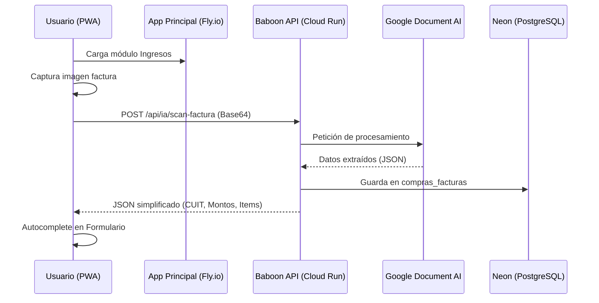

# Arquitectura Baboon AI: Scanner Document AI

Este documento describe la integración de Google Cloud Document AI para el escaneo inteligente de facturas y remitos en el módulo de Ingresos.

## 1. Visión General
El sistema utiliza una **Arquitectura Híbrida** para separar la interfaz de usuario de las tareas pesadas de procesamiento de lenguaje natural y visión artificial.

| Componente | Plataforma | Rol |
|---|---|---|
| **Frontend** | Fly.io | PWA, Interfaz de Ingresos, Gestión de Estado. |
| **IA Backend** | Google Cloud Run | Procesamiento de Imágenes, Extracción de Entidades. |
| **Persistencia** | Neon (PostgreSQL) | Almacenamiento central de facturas escaneadas. |

## 2. Flujo de Datos



## 3. Despliegue y Mantenimiento

### Actualización del Scanner (Frontend)
Si se modifica la interfaz o la lógica de captura (`ia_scanner.js`, `ingresos.js`):
1. Realizar los cambios.
2. **IMPORTANTE**: Incrementar la versión en `main.js` y `service-worker.js`.
3. `git push origin main`.

### Actualización de la extracción (Backend)
Si se modifica el prompt, los campos extraídos o la lógica de negocio en la API (`agente_facturacion_routes.py`):
1. `git push origin main`.
2. Ejecutar en Cloud Shell:
   ```bash
   gcloud run deploy baboons-api --source . --region us-central1
   ```

## 4. Estructura de Base de Datos
La tabla principal es `compras_facturas`:
- `id`: Autoincremental.
- `cuit_emisor`: Para vinculación de proveedores.
- `punto_venta` / `numero_comprobante`.
- `monto_total`: Para validación de sumas.
- `metadata_ia`: JSON con la respuesta completa de Google para auditoría técnica.

---
*Ultima actualización: Abril 2026*
